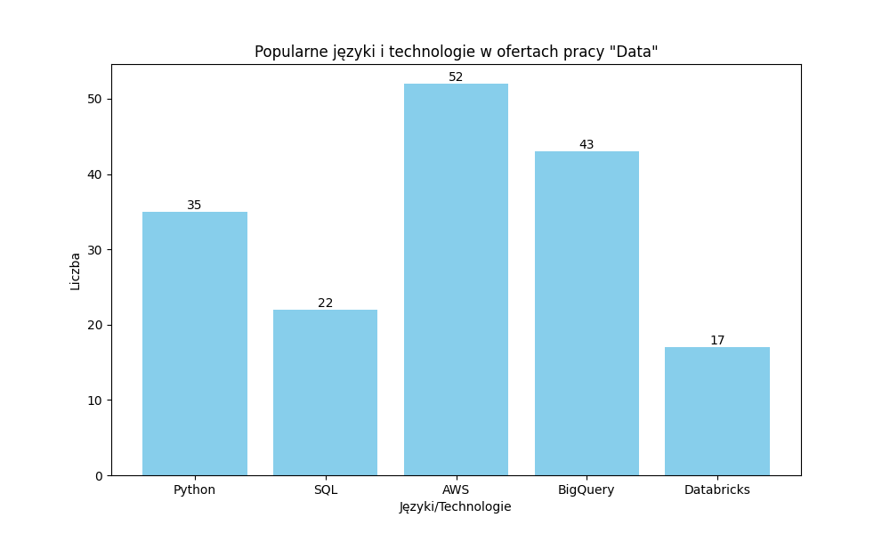
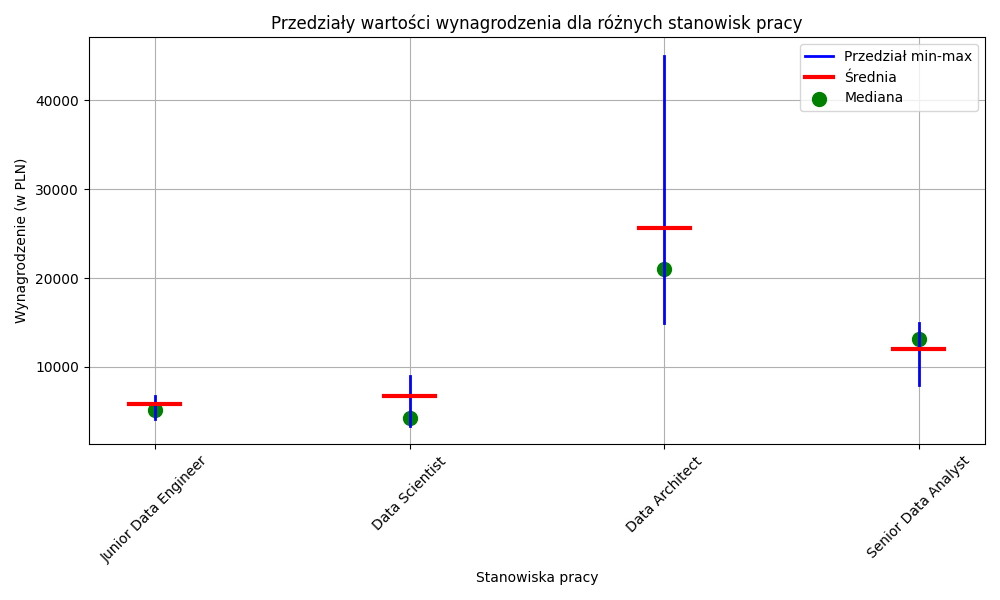

# Projekt 1 
## Cel: 
Celem projektu jest stworzenie rozwiązania, które pobierze oferty pracy z dwóch źródeł:
* [it.pracuj.pl](https://it.pracuj.pl/)
* [justjoin.it](https://justjoin.it/)

Następnie wykona prostą analizę ofert pracy pod kątem wynagrodzenia oraz technologii i umiejętności wymaganych na danych stanowiskach.

## Wymagania:
1. Pobranie danych z następującymi kryteriami (filtrami):
    * it.pracuj.pl
        * specjalizacja : Big Data/Data Science
        * oferty z widełkami wynagrodzenia
        * minimalne wynagrodzenie: 1 zł
        * lokalizacja: Kraków (odległość 0km)
        * poziom stanowiska:
            * młodszy specjalista (Junior)
            * specjalista (Mid/Regular)
            * starszy specjalista (Senior)

    * justjoin.it
        * kategoria: Data
        * lokalizacja: Kraków
        * filtr: offers with salary
        * filtr: experience
            * Junior
            * Mid
            * Senior

2. Stworzenie modelu danych zawierającego:
    * ID oferty (wewnętrznie przypisane)
    * Źródło
    * Stanowisko
    * Wynagrodzenie minimalne
    * Wynagrodzenie maksymalne
        * UWAGA: wynagrodzenie w formie godzinowej nalezy pomnozyć razy 168 (standardowa ilość godzin pracujących w miesiącu)
    * Waluta
    * Umiejętności/Technologie
        * UWAGA: w przypadku it.pracuj.pl powinny to być jedynie umiejętności/technologie wymagane (expected) 
    * Kategoria
        * Data
        * BigData/Data Science
    * Seniority
        * Zgodne z parametrami oferty
        * UWAGA: W przypadku kilku poziomów stanowiska np. oferta na Junior i Mid, proszę przypisać do oferty wyzsze Seniority

3. Zapis ofert do pliku wynikowego JSON
    * Format zgodny z modelem danych
    * Umiejętności/Technologie powinny być zapisane jako "Array"

4. Wykonanie analizy
    * Stworzenie raportu w postaci pliku JSON zawierającego dwie sekcje:
        * Umiejętności wraz z ilością wystąpień w ofertach np. {'SQL': 43, 'Databricks': 4}
        * Lista poniżej zdefiniowanych stanowisk raz z informacjami o : ilości ofert na dane stanowisko, wynagrodzenie minimalne, wynagrodzenie maksymalne, średnie wynagrodzenie
            *  Stanowiska
                * Junior Data Engineer
                * [Mid/Regular] Data Engineer
                * Senior Data Engineer

                * Junior Data Analyst
                * [Mid/Regular] Data Analyst
                * Senior Data Analyst

                * Junior Data Scientist
                * [Mid/Regular] Data Scientist
                * Senior Data Scientist

                * Junior Data Architect
                * [Mid/Regular] Data Architect
                * Senior Data Architect

    * Stworzenie wykresów
        * Wykres 10 najbardziej porządanych umiejętności/technologii
        
        * Wykres 12 wyżej ujętych stanowisk z informacjami o minimalnym, maksymalnym oraz średnim wynagrodzeniu.
        

5. Co ma się znalezc w repozytorium?
    * Pliki programu napisanego w pythonie
    * Pliki JSON
        * Wszystkie pobrane oferty w formacie modelu danych (pkt3)
        * Raport (pkt4)

6. Termin oddania projektu: `16.04.2024`

7. Uwagi końcowe
    * Dobra praktyki
        * Modularyzacja
        * Obsługa wyjątków

8. Ocenianie
    * 3.5: jedno z dwóch źródeł danych, model danych, plik JSON z ofertami
    * 4.0: obsługa obu źródeł danych, model danych, plik JSON z ofertami
    * 5.0: obsługa obu źródeł danych, model danych, pliki JSON oraz wykresy

